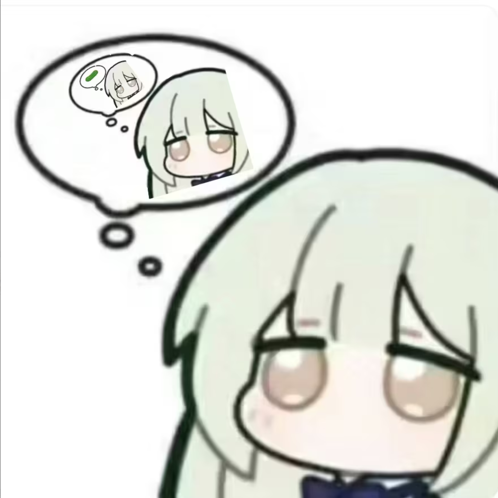

<h1 align="center">Mutsumi Pet</h1>
<p align="center">
  
</p>
<p align="center">
  <a style="text-decoration:none;"style="color:black;"> English </a>
  ·
  <a href="README.zh-CN.md">简体中文</a>
</p>

Mutsumi Pet is a Windows WPF desktop pet app. It uses Win32 APIs to observe lightweight computer usage state and calls a large language model to generate speech-bubble lines.

> Current version: v1.1 

---

## Feature Overview

### 1. Desktop Pet Display

- Supports left-click dragging
- Provides a right-click menu for refreshing dialogue, pausing interaction, and exiting

### 2. Computer Usage Awareness

- `WindowsUsageMonitor` uses Win32 APIs to read foreground-window and idle state
- Current recorded context:
  - foreground process name
  - foreground window title
  - idle seconds
  - active-window duration
  - recent usage event
  - Windows session lock state

### 3. LLM Speech Bubbles

- `LlmClient` calls an OpenAI-compatible API to generate bubble lines
- Prompts distinguish normal interaction from message reminders

---

## Directory Overview

| Path | Description |
| --- | --- |
| `App.xaml` / `App.xaml.cs` | WPF application entry |
| `MainWindow.xaml` | Desktop pet window, character image, and bubble layout |
| `MainWindow.xaml.cs` | Window events, timers, dragging, and speech display orchestration |
| `Services/LlmClient.cs` | LLM requests, prompt construction, and response parsing |
| `Services/WindowsUsageMonitor.cs` | Foreground-window, idle-time, and session-state monitor |
| `Services/ChatAppMessageMonitor.cs` | Messaging app new-message signal detection |
| `Services/SpeechQueueService.cs` | Long-text segmentation and display timing |
| `Services/ImageTransparencyService.cs` | Character image white-background transparency processing |
| `Models/` | Models for usage state, triggers, and message signals |
| `mutsumi.png` | Desktop pet character image |
| `.env.example` | LLM configuration template |

---

## Quick Start

Requirements:

- Windows 10/11
- .NET 8 SDK
- An OpenAI-compatible chat-completions endpoint

### Download the MutsumiPet.exe

If you only want to use the app locally, downloading the packaged Windows release is recommended. This path does not require cloning the source code or installing the .NET 8 SDK.

1. Open the [GitHub Releases](https://github.com/Reachrich55/Mutsumi-Pet/releases/latest) page for this repository
2. Download the latest `MutsumiPet-*-win-x64.zip`
3. Extract it to a local folder, for example:

```text
D:\Apps\MutsumiPet
```

4. In the extracted folder, copy `.env.example` and rename the copy to `.env`
5. Edit `.env` and fill in your own LLM configuration:

```text
LLM_API_KEY="YOUR_API_KEY"
LLM_BASE_URL="YOUR_BASE_URL"
LLM_MODEL="YOUR_MODEL_NAME"
LLM_TIMEOUT_SECONDS="60"
```

6. Run `MutsumiPet.exe`

`.env` must be placed in the same folder as `MutsumiPet.exe`. Do not upload your `.env` file or API key to public repositories, screenshots, or issues.

If the app only shows local fallback lines, the LLM configuration, network connection, or endpoint permission may be invalid. Check that the file is named exactly `.env`, that the API key is usable, and that `LLM_BASE_URL` points to an OpenAI-compatible `/v1` endpoint.

### For Developers

```powershell
git clone <your-repo-url>
Set-Location .\mutsumi_pet
Copy-Item .\.env.example .\.env
dotnet restore
dotnet run
```

Edit `.env` and fill in your own LLM configuration:

```text
LLM_API_KEY="replace-with-your-key"
LLM_BASE_URL="https://your-openai-compatible-endpoint/v1"
LLM_MODEL="your-model-name"
LLM_TIMEOUT_SECONDS="60"
```

With the source setup, `.env` lives in the project root. It is ignored by `.gitignore` and should not be committed.

---

## Configuration and Runtime Data

### LLM Configuration

The app reads configuration from `.env` or environment variables. Environment variables take precedence over `.env`.

| Key | Description |
| --- | --- |
| `LLM_API_KEY` | LLM API Key |
| `LLM_BASE_URL` | OpenAI-compatible API base URL, usually ending with `/v1` |
| `LLM_MODEL` | Model name |
| `LLM_TIMEOUT_SECONDS` | Request timeout in seconds |

### Runtime Artifacts

The following files and folders are considered local runtime or build artifacts and should not be committed to Git:

- `.env`
- `bin/`
- `obj/`
- `artifacts/`
- `.vs/`
- `*.user`
- `*.suo`

---

## Privacy Boundaries

The app may send the following context to your configured LLM:

- foreground process name
- foreground window title
- idle time
- active-window duration
- recent usage event
- session lock state
- messaging app new-message signal
- messaging app display name
- message signal time

The app does not collect or send:

- keyboard input
- screenshots
- messaging app chat content
- sender names or group names
- messaging app local databases
- network packets
- files from the user's computer

---

## Packaging and Release

Publishing a self-contained Windows x64 package is recommended:

```powershell
dotnet publish .\MutsumiPet.csproj `
  -c Release `
  -r win-x64 `
  --self-contained true `
  /p:PublishSingleFile=true `
  /p:IncludeNativeLibrariesForSelfExtract=true `
  /p:EnableCompressionInSingleFile=true `
  -o .\artifacts\github-release\MutsumiPet-win-x64
```

---

## Credits

Thanks to Yousou for drawing the cute Mutsumi.

---

## License

This project is licensed under the MIT License. See [LICENSE](LICENSE) for details.
